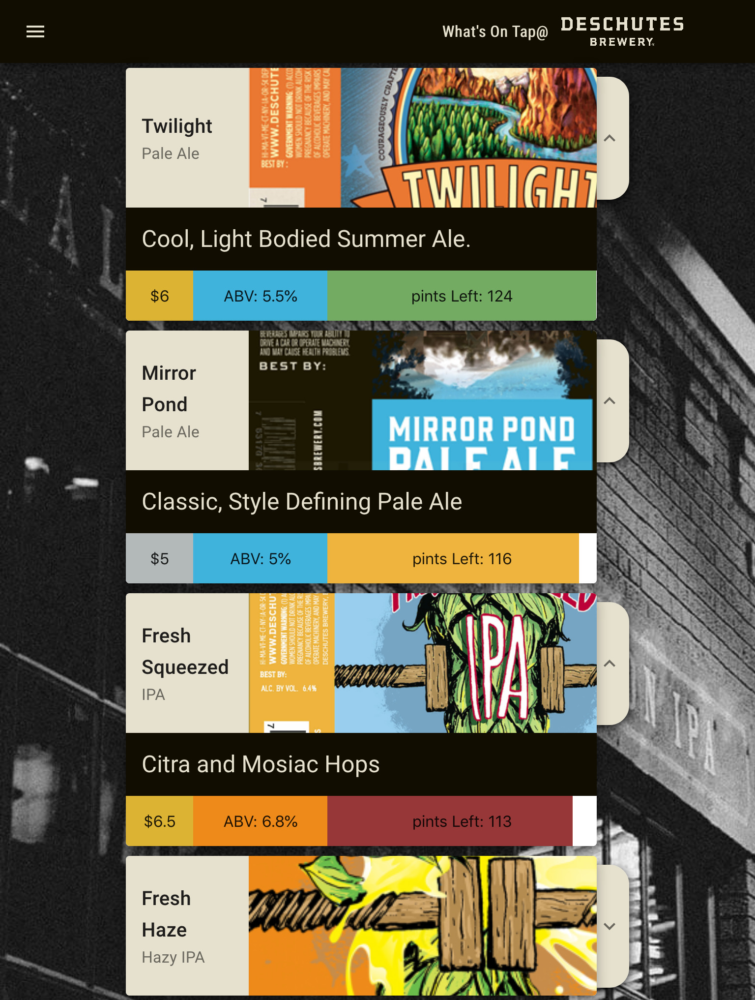
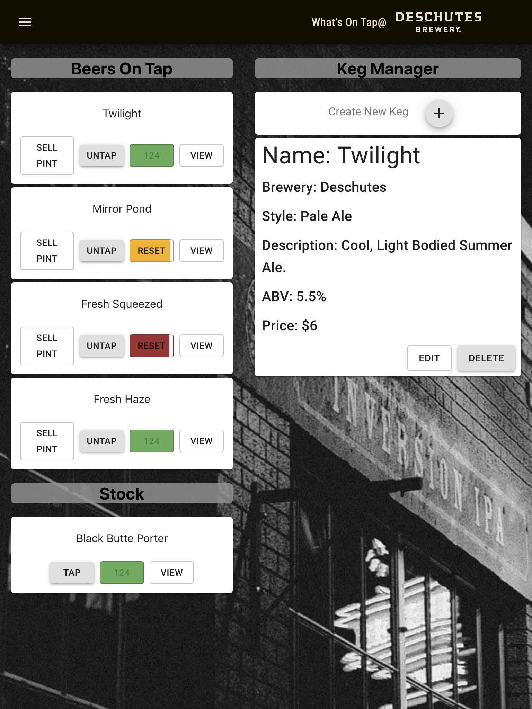
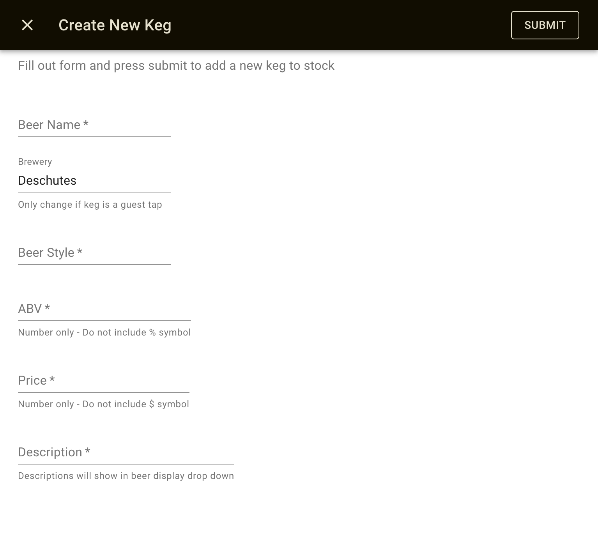

# 
What's OnTap@

A keg/beer menu CRUD application for all taprooms, but designed and styled specifically for the Deschutes Brewery.

This project was bootstrapped with [Create React App](https://github.com/facebook/create-react-app).

## Author: Dustin Herboldshimer
## Version: 0.0.3 July 14, 2019

### See Live Demo on gh-pages: <a href='https://duherb.github.io/OnTap>On Tap Demo</a>
### Development Resources:

#### WireFrame and Component Tree:
The original concept wifeframe with basic views and card style layout.  POS view was removed in version 0.0.2 as the Admin view developed more functionality and adopted a card style managment schema rather than the select boxes as shown in the wireframes.

This project used styles and assets from the Deschutes Brewery.  This project was originally concieved while I was an employee at their Portland, OR pub. We were tapping so many kegs so quickly, managers couldn't keep up with updateing the current taplist on the brewery website and customers would come in looking for beers we were no longer serving.

New beers, edits, and tap changes are instantly reflected in the Patron View.  Or they will be -- This project currently has no persistent data other than a hardcoded store with 5 demo beers.  I would like to look into using apollo and graphQL to interface with a cloud service to persist data.

Full page form takes care of both new keg creation and edit actions.  Depending on the 'editMode', header displays appropriate header and button text.  If editing and exisiting keg, form inputs are set with the currently viewed keg's info. Otherwise, form is reset after submission.

### TODO Wishlist:
- Locations Tabs allowing admins to use same keg stock list to display unique taplists at multiple locations
- Dynamic background images depending on selected location
- image file uploading for new beers
- image view in tap editor window
- admin authentication
- customizable theme colors and background images
- 'up next' section (as shown in concept)
- write unit tests
- database/api hookup
- form validation

### View Project

- [your local directory]$ git clone https://github.com/DuHerb/OnTap.git
- [OnTap]$ npm install
- [OnTap]$ npm start

### Testing
As of right now, no tests have been written.  It is a goal, and I will update when/if I can get to it.

## Other Dependencies
- material ui core and styles
- react reach
- uuid

## License

MIT

Copyright (c) 2019 **Dustin Herboldshimer**

